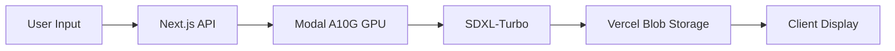

# Pentagram: Instagram, but with AI Images


A modern web application that generates high-quality images using Stable Diffusion XL Turbo, powered by Modal's A10G GPU infrastructure.


Youtube demo : https://youtu.be/gO-RcNphq44

## 🚀 Features

- **Fast Image Generation**: Generate high-quality images in under 2 seconds
- **Real-time Updates**: Live loading states and image preview
- **Efficient Storage**: Automated image storage using Vercel Blob Storage

## ⚡ Tech Stack

### Frontend
- Next.js 14 (React)
- TypeScript
- Tailwind CSS
- React Hooks

### Backend
- Next.js API Routes
- Modal Cloud GPU (NVIDIA A10G)
- Stable Diffusion XL Turbo
- Vercel Blob Storage

## 🛠 Installation

1. Clone the repository:
```bash
git clone https://github.com/yourusername/project-name.git
```

2. Install dependencies:
```bash
npm install
```

3. Set up environment variables:
Create a `.env` file in the root directory with the following variables:
```env
PENTAGRAM_URL=your_pentagram_url
API_TOKEN_PENTAGRAM=your_api_token
BLOB_READ_WRITE_TOKEN=your_blob_token ( from vercel)
```

4. Run the development server:
```bash
npm run dev
```

## 🌐 Usage

1. Open the application in your browser
2. Enter a description of the image you want to generate
3. Click "Generate" and wait for your image
4. The generated image will be displayed and automatically saved

## ⚙️ Architecture



## 🔑 Environment Variables

- `PENTAGRAM_URL`: URL for the image generation service (from modal)
- `API_TOKEN_PENTAGRAM`: Authentication token for the API
- `BLOB_READ_WRITE_TOKEN`: Token for Vercel Blob Storage access

## 🚀 Deployment

This project is optimized for deployment on Vercel:

1. Push your code to GitHub
2. Connect your repository to Vercel
3. Configure environment variables in Vercel dashboard
4. Deploy!

## 📈 Performance

- Image Generation: ~2 seconds
- API Response Time: ~200ms
- Blob Storage Upload: ~500ms


## 👏

- [Modal](https://modal.com/) for GPU infrastructure
- [Stable Diffusion](https://stability.ai/) for the SDXL-Turbo model
- [Vercel](https://vercel.com/) for hosting and blob storage


Made with ❤️ by  Sheick


